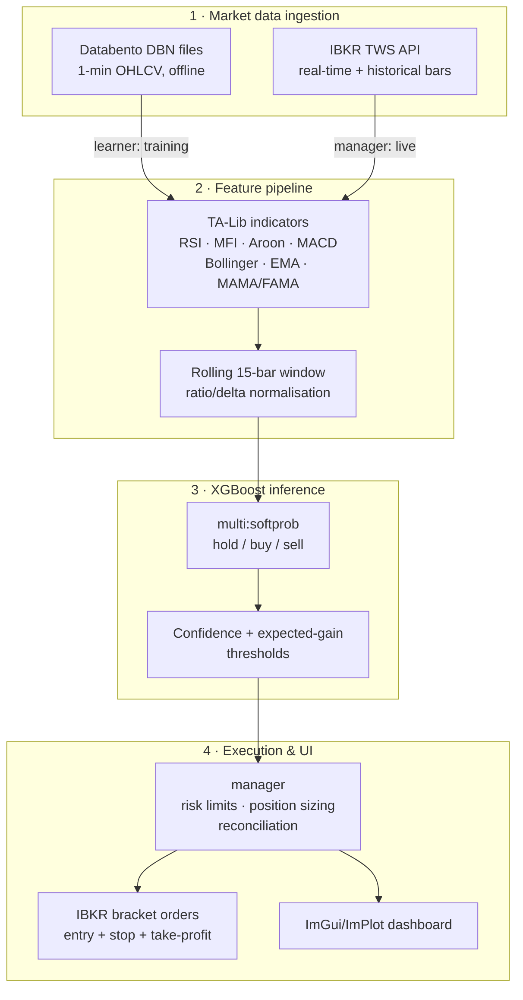

# Orama

A single-binary C++23 trading system that ingests 1-minute NASDAQ-100 bars, computes technical features, runs XGBoost inference, and executes bracket orders against Interactive Brokers' paper-trading API. With a real-time ImGui/ImPlot dashboard attached to the live process.

> **Paper trading only.** This is an engineering project, not an investment product. See [Disclaimer](#disclaimer).

---

## Screenshots

> **TODO — add dashboard screenshots here.**
>
> No images are committed to this repository yet. To add them:
> 1. Run the binary with the GUI enabled (the default build).
> 2. Capture the **Targets**, **Positions**, and **Session Stats** windows, plus the
>    price/RSI/MACD ImPlot panes.
> 3. Save them under `docs/images/` and replace this block with:
>    ```markdown
>    
>    ```
>
> `docs/` is not gitignored, so committed screenshots will be picked up normally.

The dashboard renders in the same process as the trading loop and exposes: live candles with
indicator overlays, per-symbol model action probabilities, tracked targets, entry candidates,
working orders, open positions, and session counters.

---

## Architecture

Orama is one process and one binary. Market data flows in from two different sources depending
on mode, recorded DBN files during training, the broker's live feed during execution. Through
a shared feature pipeline into the same model code, so training and inference cannot drift apart.



### Module map

| Path | Responsibility |
|---|---|
| `core/` | Entry point, logging, market types, TA-Lib wrapper, runtime config |
| `core/broker/` | IBKR TWS API client — connection, subscriptions, order placement, callbacks |
| `learner/` | Offline training: reads Databento DBN files, builds labelled feature vectors |
| `model/` | XGBoost booster lifecycle — train, early stopping, save/load, predict |
| `manager/` | Live orchestration: target selection, inference, risk limits, order state machine |
| `user/` | Account abstraction — sizing, FX conversion, order helpers |
| `interface/` | ImGui/ImPlot dashboard, reading a mutex-guarded snapshot of manager state |

## Build

### Prerequisites

Dependencies are fetched and built by CMake, you do not need to install XGBoost, TA-Lib,
protobuf, or the GUI stack yourself.

- **CMake ≥ 3.30** and **Ninja**
- **macOS**: `brew install llvm libomp cmake ninja`. Apple Clang does not ship OpenMP, which
  XGBoost requires. The build prefers Homebrew LLVM automatically when present.
- **Linux**: `clang` (or `gcc`), `cmake`, `ninja`, and standard build tooling.
- **Windows**: Visual Studio 2022 with "Desktop development with C++". Configure and build from
  an **x64 Native Tools Command Prompt**.

### 1. Obtain the IBKR TWS API (required)

Interactive Brokers' license does not permit redistributing their API source, so it is **not**
included in this repository and never has been. Download it separately:

- Official public repository: **https://github.com/InteractiveBrokers/tws-api-public**
- (Or the TWS API download on Interactive Brokers' own API software page.)

Place the files so the build can find them:

```
core/twsapi/           <- contents of  source/cppclient/client/  from the SDK
core/twsapi/libbid/    <- the platform decimal-math library from the same SDK
                          (libbid.a on macOS/Linux, .lib on Windows)
```

### 2. Configure and build

```bash
cmake --preset release && cmake --build --preset release
```

Other presets: `debug` (ASan + UBSan), `linux-release`, `linux-debug`, `windows-release`,
`windows-debug`. The first configure clones and builds every dependency from source and takes
several minutes.

Headless deployments (no display server) should disable the GUI:

```bash
cmake --preset linux-release -DORAMA_USE_GUI=OFF
```

### 3. Runtime expectations

The binary connects to TWS/IB Gateway on `127.0.0.1:7497` (the default paper-trading socket)
with client id 1. Enable API access in TWS under **Settings → API → Settings**, and make sure
the socket port there matches.

It expects `gen/` (model artifacts) and, for training, `raw_data/` (DBN files) relative to its
own location.

---

## Technical summary

| |                                                                                                                               |
|---|-------------------------------------------------------------------------------------------------------------------------------|
| **Language** | C++23                                                                                                                         |
| **Architecture** | Single statically-linked binary. no runtime service dependencies                                                              |
| **Model** | XGBoost, `multi:softprob`, 3 classes (hold / buy / sell)                                                                      |
| **Features** | Per-bar OHLCV deltas plus TA-Lib indicators over a rolling 15-bar window                                                      |
| **Data** | 1-minute NASDAQ-100 OHLCV bars (Databento DBN for training, IBKR for live)                                                    |
| **Execution** | IBKR TWS API, bracket orders (entry limit + stop-loss + take-profit)                                                          |
| **UI** | Dear ImGui + ImPlot, optional at compile time                                                       |
| **Build** | CMake + Ninja, all dependencies pinned and built via `FetchContent`                                                           |
| **Mode** | **Paper trading only**                                                                                                        |

### Data and model artifacts

Neither the training data nor the trained model is committed:

- **Market data** (`raw_data/`) is licensed from a data vendor to the account holder and may not
  be redistributed. The ingestion and training code is included, so the pipeline is reproducible
  by anyone with their own data licence.
- **Trained weights** (`gen/`) are a large build output, regenerated by the training pipeline
  rather than version-controlled.

### Known limitations

- The IBKR dependency is compiled directly into `manager`/`user` rather than sitting behind a
  broker interface, so the project cannot currently be built or tested without the TWS API SDK.
  This is the most significant piece of technical debt in the codebase.
- There is no automated test suite. Correctness currently rests on sanitizer-enabled debug
  builds, static analysis, and manual paper-trading observation.
- Windows support is implemented but has not been verified end-to-end on hardware. Development
  is on macOS and deployment on Linux.

---

## Disclaimer

This project is published for **educational and portfolio purposes**.

- It is configured for **paper trading only** and is not intended for live trading with real
  capital.
- Nothing here is investment advice, a solicitation, or a recommendation to trade any security.
- **No claim is made about profitability.** No performance figures, returns, or strategy
  results are published in this repository, and none should be inferred from its existence.
- Algorithmic trading carries substantial risk of loss. Anyone adapting this code does so
  entirely at their own risk, and is responsible for their own compliance with their broker's
  and data vendor's terms.
- Not affiliated with, endorsed by, or connected to Interactive Brokers or any data vendor.

## License

[MIT](LICENSE) © 2026 Emil Johansson.

Covers Orama's own source only. Third-party dependencies fetched during the build remain under
their own licenses, and Interactive Brokers' TWS API — not redistributed here — remains subject
to IBKR's terms.
