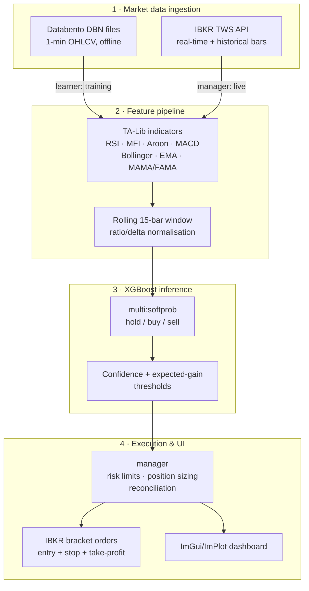

# Orama

I built Orama to see if I could take a trading idea all the way from a data pipeline to a
live-connected system, not just a backtest in a notebook. It is a single C++23 binary that reads
1-minute NASDAQ-100 bars, builds features from them, runs those features through an XGBoost
model, and sends bracket orders to Interactive Brokers' paper trading API. It also has a live
dashboard built with ImGui and ImPlot so I can actually watch what it is doing while it runs.

> **Paper trading only.** This is a systems engineering project, not a pitch for a trading
> strategy. See the [Disclaimer](#disclaimer) at the bottom.

---

## Screenshots

> **TODO, add dashboard screenshots here.**
>
> I have not committed any images yet. To add them:
> 1. Run the binary with the GUI turned on (this is the default build).
> 2. Take screenshots of the Targets, Positions, and Session Stats windows, plus the
>    price/RSI/MACD panes.
> 3. Save them under `docs/images/` and swap this section for:
>    ```markdown
>    
>    ```
>
> `docs/` is not gitignored, so committed screenshots will show up normally.

The dashboard runs in the same process as the trading loop. It shows live candles with
indicator overlays, model probabilities per symbol, tracked targets, entry candidates, working
orders, open positions, and a few session counters.

---

## Architecture

Orama is one process and one binary. Market data comes in from two places depending on the
mode. Recorded DBN files during training, and the broker's live feed during execution. Both
paths go through the same feature pipeline and the same model code, so training and inference
can't drift apart from each other.



### Module map

| Path | Responsibility |
|---|---|
| `core/` | Entry point, logging, market types, TA-Lib wrapper, runtime config |
| `core/broker/` | IBKR TWS API client, connection, subscriptions, order placement, callbacks |
| `learner/` | Offline training, reads Databento DBN files, builds labelled feature vectors |
| `model/` | XGBoost booster lifecycle, train, early stopping, save/load, predict |
| `manager/` | Live orchestration, target selection, inference, risk limits, order state machine |
| `user/` | Account abstraction, sizing, FX conversion, order helpers |
| `interface/` | ImGui/ImPlot dashboard, reads a mutex-guarded snapshot of manager state |

## Build

### Prerequisites

CMake fetches and builds all the dependencies. You do not need to install XGBoost, TA-Lib,
protobuf, or the GUI stack yourself.

- **CMake 3.30 or newer** and **Ninja**
- **macOS**: run `brew install llvm libomp cmake ninja`. Apple Clang does not ship OpenMP, and
  XGBoost needs it. The build looks for Homebrew LLVM automatically if it is there.
- **Linux**: `clang` (or `gcc`), `cmake`, `ninja`, and the usual build tools.
- **Windows**: Visual Studio 2022 with "Desktop development with C++". Configure and build from
  an **x64 Native Tools Command Prompt**.

### 1. Get the IBKR TWS API (required)

Interactive Brokers does not allow redistributing their API source, so it is **not** included in
this repo and never has been. You need to download it yourself:

- Official repo: **https://github.com/InteractiveBrokers/tws-api-public**
- Or through the TWS API download on Interactive Brokers' own site.

Put the files here so the build can find them:

```
core/twsapi/           <- contents of  source/cppclient/client/  from the SDK
core/twsapi/libbid/    <- the platform decimal-math library from the same SDK
                          (libbid.a on macOS/Linux, .lib on Windows)
```

### 2. Configure and build

```bash
cmake --preset release && cmake --build --preset release
```

Other presets: `debug` (with ASan and UBSan), `linux-release`, `linux-debug`, `windows-release`,
`windows-debug`. The first configure step clones and builds every dependency from source, so it
takes a few minutes.

If you are running headless with no display server, turn the GUI off:

```bash
cmake --preset linux-release -DORAMA_USE_GUI=OFF
```

### 3. What it expects at runtime

The binary connects to TWS or IB Gateway on `127.0.0.1:7497` (the default paper trading socket)
with client id 1. Enable API access in TWS under **Settings → API → Settings** and make sure the
port there matches.

It expects a `gen/` folder for model artifacts, and for training, a `raw_data/` folder for DBN
files, both relative to where the binary sits.

---

## Technical summary

| | |
|---|---|
| **Language** | C++23 |
| **Architecture** | One statically linked binary, no runtime service dependencies |
| **Model** | XGBoost, `multi:softprob`, 3 classes (hold / buy / sell) |
| **Features** | Per-bar OHLCV deltas plus TA-Lib indicators over a rolling 15-bar window |
| **Data** | 1-minute NASDAQ-100 OHLCV bars (Databento DBN for training, IBKR for live) |
| **Execution** | IBKR TWS API, bracket orders (entry limit + stop-loss + take-profit) |
| **UI** | Dear ImGui + ImPlot, optional at compile time |
| **Build** | CMake + Ninja, all dependencies pinned and built via `FetchContent` |
| **Mode** | **Paper trading only** |

### Data and model files

I do not commit the training data or the trained model.

- **Market data** (`raw_data/`) is licensed from a data vendor to my account, and I am not
  allowed to redistribute it. The code that reads and trains on it is all here though, so anyone
  with their own data licence can reproduce the pipeline.
- **Trained weights** (`gen/`) are a build output rather than something I version control. You
  regenerate them by running the training pipeline yourself.

### Known limitations

- The IBKR dependency is compiled directly into `manager` and `user` instead of sitting behind a
  proper broker interface. That means the project cannot currently be built or tested without
  the TWS API SDK. This is the biggest piece of technical debt in the codebase right now.
- There is no automated test suite yet. Correctness currently relies on sanitizer-enabled debug
  builds, static analysis, and watching it paper trade.
- Windows support is implemented but I have not verified it end to end on real hardware.
  Development happens on macOS and deployment on Linux.

---

## Disclaimer

I am publishing this for educational and portfolio purposes.

- It is set up for **paper trading only**. It is not meant for live trading with real capital.
- Nothing here is investment advice, a solicitation, or a recommendation to trade any security.
- **I am not claiming this is profitable.** I have not published any performance figures,
  returns, or strategy results in this repository, and none should be assumed just because the
  project exists.
- Algorithmic trading can lose real money. If you adapt this code, that is entirely on you, and
  you are responsible for following your own broker's and data vendor's terms.
- I am not affiliated with, endorsed by, or connected to Interactive Brokers or any data vendor.

## License

[MIT](LICENSE) © 2026 Emil Johansson.

This covers Orama's own source code only. Third-party dependencies fetched during the build stay
under their own licenses, and Interactive Brokers' TWS API, not redistributed here, stays subject
to IBKR's own terms.